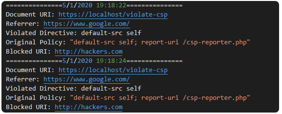

# CSP-Reporter
A simple PHP CSP reporter script that saves violations to disk.

## Usage
Put the `csp-reporter.php` on your web server, or in your local directory were you have your website PHP files, and specify `csp-reporter.php` in your CSP `report-uri` directive (ref. [7.13](https://www.w3.org/TR/CSP2/#directive-report-uri)).

**Note**: CSPv3 is still in its [draft](https://w3c.github.io/reporting/), therefore, CSPv2 will continue to work and there will most likely be backward compatibility.

## Output "csp-violations.log"

